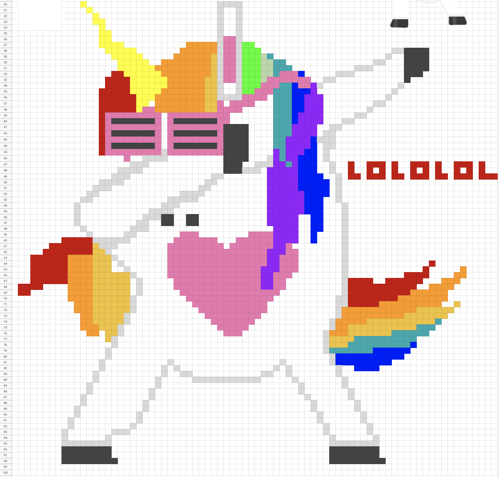
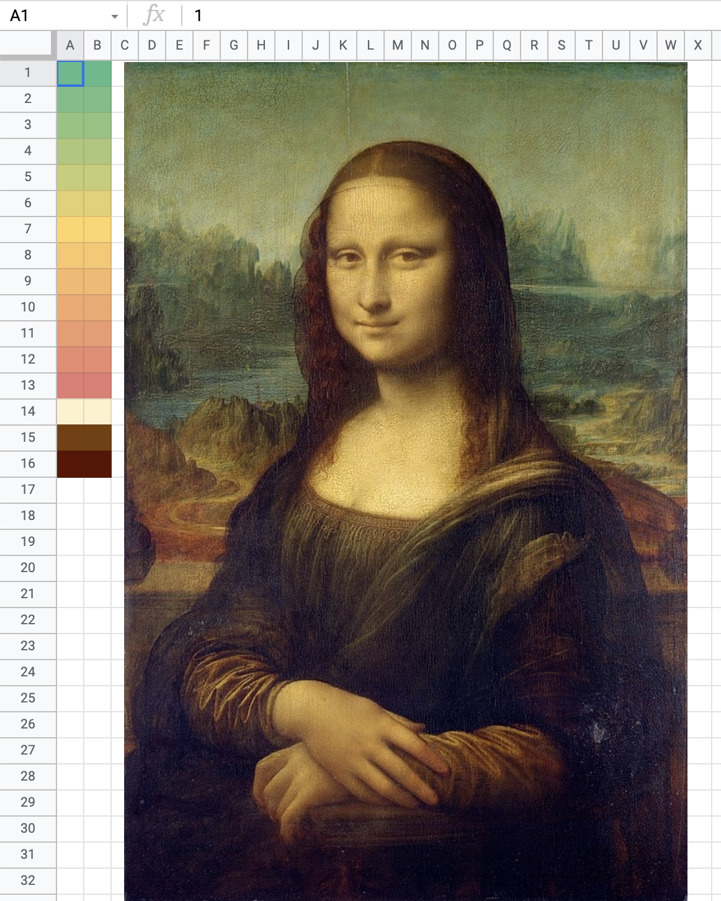

This one was pretty fun. During a team social - we were asked to draw a picture in Google Sheets given a color pallete - 1 was red, 2 was blue, 3 was black, etc.

First - we had to create this image 

Which we ended up doing in grids - this took about 10 minutes between 4 of us. 

 

We won the contest - but there was a second tab of the Mona Lisa we weren't able to get to. 



However - I got bored over my lunch break - and was able to code up the following algorithm.

```
from functools import lru_cache

import PIL
import numpy
import pandas as pd
from scipy.spatial import distance
from numpy import asarray
from PIL import Image
# Open the image form working directory
image = Image.open('/Users/nick/Downloads/mona_low_res.png').convert('RGB')

excel_points = {
 1: (113,184,142),
    2 : (133,188,137),
    3 : (154,194,133),
    4 : (177,198,129),
    5 : (200,204,126),
    6 :(224,209,122),
    7 : (249,214,120),
    8 : (243,200,119),
    9 : (238,187,118),
    10 : (233,171,118),
    11 : (227,158,118),
    12 : (222,143, 118),
    13  : (216,129,119),
    14 : (253,242,208),
    15 : (113,65,22),
    16 : (83,22,7)
}

def distance_between_two_points (first_rgb, second_rgb) -> float:
    dst = distance.chebyshev(first_rgb, second_rgb)
    return dst

@lru_cache
def closet_color(rgb_tuple) -> int:
    distances = [(x,distance_between_two_points(rgb_tuple,y)) for x,y in excel_points.items()]
    closet_match = min(distances, key=lambda t: t[1])
    return closet_match[0]

data = asarray(image)
new_array = numpy.empty((data.shape[0],data.shape[1]))
saver_image =  numpy.empty((data.shape[0],data.shape[1],3))
for index_x, x in enumerate(data):
    print(f"{index_x} / {len(data)}")
    for index_y, y in enumerate(x):
        #cast as tuple for LRU cacheing. Minor speed improvement. Can probably do a full multithread - but
        # yolo.
        val = closet_color(tuple(y))
        new_array[index_x,index_y] = val

pd.DataFrame(new_array).to_clipboard()
```

I used Digital Color Meter to get the RGB values for the dictionary - and this great `PIL` library. Doing so - I was able to get the following 

There's a lot of fun you can do with modern python :).